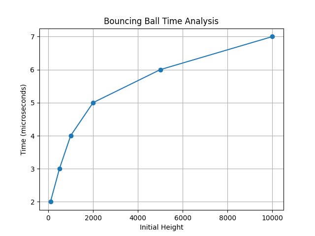

# Week 1 - ADA Lab

## Program: Bouncing Ball Analysis

### Description

This program simulates the motion of a bouncing ball. The ball is dropped from a certain height and loses 40% of its velocity after each bounce. The program calculates the number of bounces until the height becomes zero.

### Input

Initial height of the ball (h)

### Output

* Number of bounces
* Execution time for different input sizes

### Time Complexity

T(n) = O(log h)

### Methodology

* The velocity is calculated using the formula: v = √(2gh)
* After each bounce, velocity is reduced by 40%
* The new height is calculated using the reduced velocity
* This process continues until height becomes zero
* Execution time is measured using the chrono library in C++
* The program is tested for different values of height
* A graph is plotted using Python to analyze performance

### Graph

### Observation

The graph shows a logarithmic trend. As the initial height increases, the number of bounces increases slowly, confirming the time complexity O(log h).

### Files Included

* `bounces.cpp` → C++ implementation
* `bouncesgraph.py` → Python script for graph
* `bounces_graph.png` → Graph image

### Author

Vinayak
