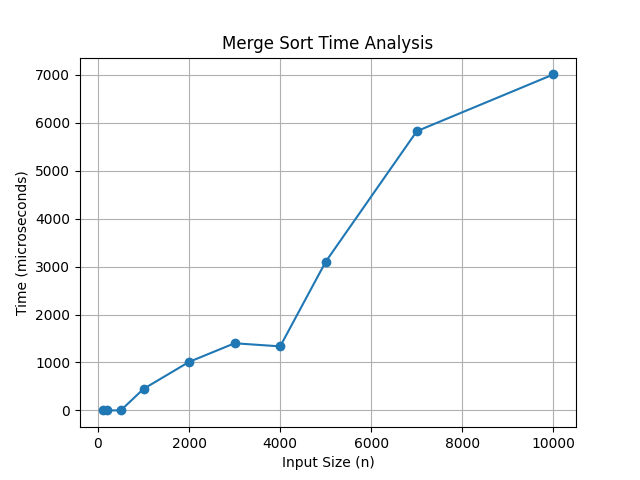

# Week 1 - ADA Lab

## Program: Merge Sort

### Description

This program implements the Merge Sort algorithm using the divide and conquer technique. It recursively divides the array into smaller subarrays, sorts them, and then merges them back together.

### Input

Array of integers of size n

### Output

Sorted array and execution time for different input sizes

### Time Complexity

T(n) = O(n log n)

### Methodology

* The array is divided into two halves recursively.
* Each half is sorted independently using recursion.
* The sorted halves are merged using a merge function.
* Execution time is measured using the chrono library.
* The algorithm is tested for different input sizes.
* A graph is plotted using Python to analyze performance.

### Graph

### Observation

The graph shows growth slightly faster than linear but slower than quadratic, confirming the time complexity O(n log n).

### Files Included

* `merge_sort.cpp` → C++ implementation
* `graph.py` → Python script for graph
* `merge_sort_graph.png` → Graph image

### Author

Vinayak
