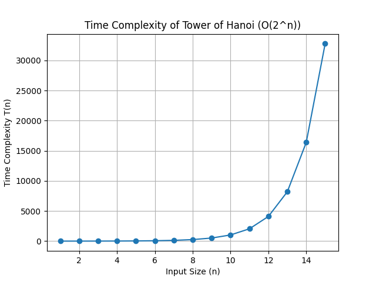

# Week 1 - ADA Lab

## Program: Tower of Hanoi

### Description

This program implements the Tower of Hanoi problem using recursion.

### Input

Number of disks (n)

### Output

Sequence of moves required to solve the problem.

### Time Complexity

T(n) = O(2^n)

### Methodology

- The algorithm is implemented using recursion in C++.
- The number of moves is calculated using the algorithm.
- A graph is plotted using Python for n = 1 to 100.

### Graph

### Observation

The graph shows exponential growth, confirming the time complexity O(2^n).

### Files Included

- `hanoi.cpp` → C++ implementation
- `graph.py` → Python script for graph
- `hanoi_time_complexity.png` → Graph image

### Author

Vinayak
