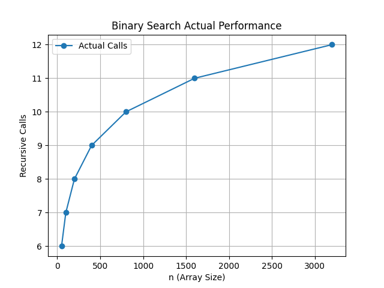

# Week 2 - ADA Lab

## Program: Binary Search (Recursive)

### Description

This program implements Binary Search using recursion to find an element in a sorted array.

### Input

Sorted array of elements and a target value to search

### Output

Index of the target element (if found) and number of recursive calls

### Time Complexity

T(n) = O(log n)

### Methodology

* The array is divided into two halves at each step.
* The middle element is compared with the target value.
* If the element is smaller, search continues in the right half.
* If larger, search continues in the left half.
* Recursive calls are counted to analyze performance.
* A graph is plotted using Python to show relationship between input size and recursive calls.

### Graph

### Observation

The graph shows very slow growth in recursive calls as input size increases, confirming logarithmic time complexity O(log n).

### Files Included

* `binary_search_recursive.cpp` → C++ implementation
* `graph.py` → Python script
* `binary_search_graph.png` → Graph image

### Author

Vinayak
