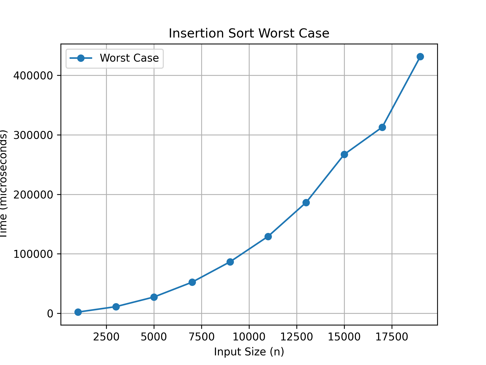

# Week 2 - ADA Lab

## Program: Insertion Sort (Worst Case Analysis)

### Description

This program implements Insertion Sort and analyzes its performance in the worst-case scenario using different input sizes.

### Input

Array of elements arranged in decreasing order (reverse sorted array)

### Output

Execution time taken to sort the array for different values of n

### Time Complexity

T(n) = O(n²)

### Methodology

* Arrays of different sizes (n) are generated.
* Each array is initialized in reverse sorted order (worst case).
* Insertion Sort is applied to the array.
* Execution time is measured using high-resolution clock.
* Results are stored in a CSV file.
* A graph is plotted using Python to show the relationship between input size and execution time.

### Graph

### Observation

The graph shows a steep increase in execution time as input size increases, confirming quadratic time complexity O(n²).

### Files Included

* `insertion_sort.cpp` → C++ implementation
* `insertion_worst_case.csv` → Recorded data
* `graph.py` → Python script
* `insertion_sort_worst.png` → Graph image

### Author

Vinayak
